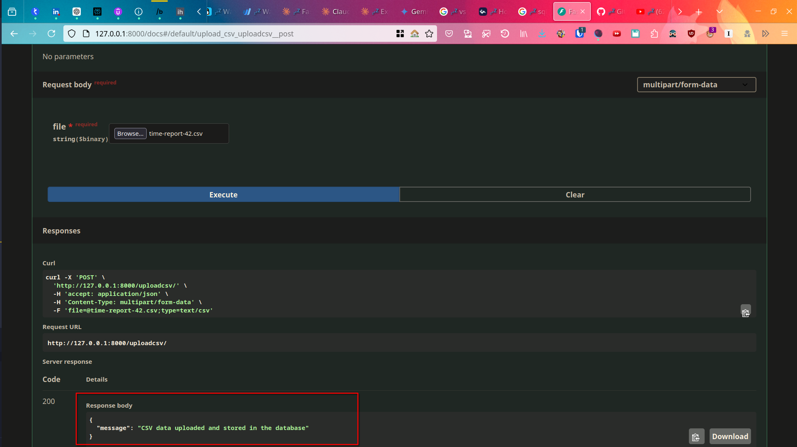
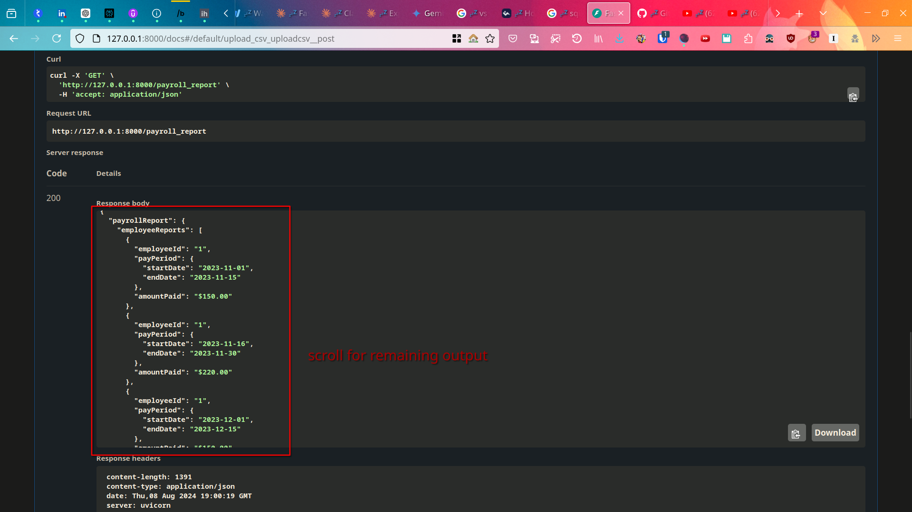
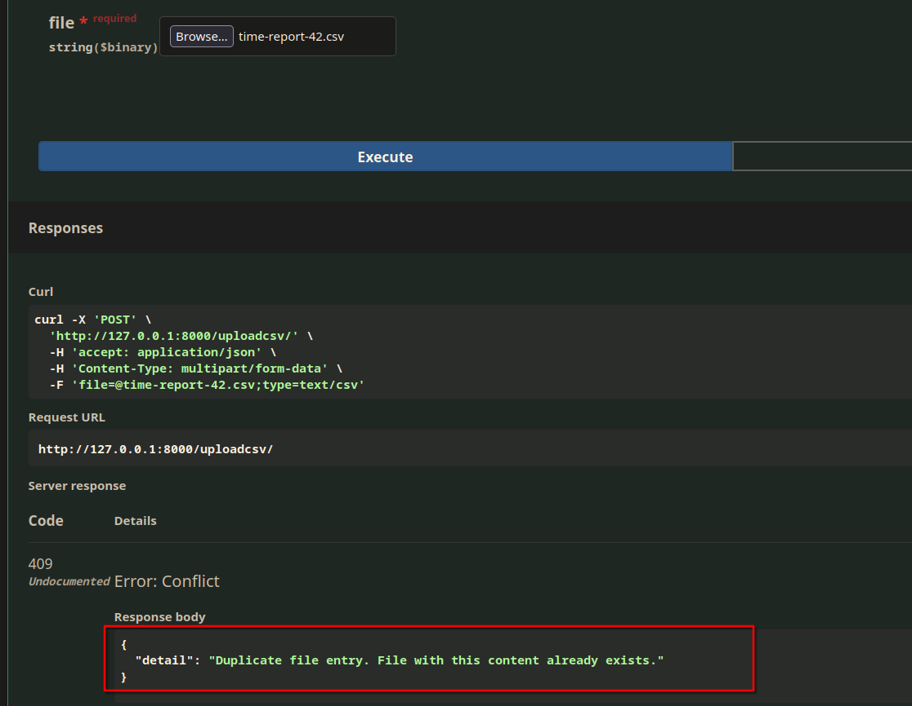

# 🚀 How to Run:

- Navigate to project root folder & setup virtual environment using `python -m venv venv`
- Install dependencies `pip install -r requirements.txt`
- Run fastapi app using `uvicorn app.main:app --reload`
- visit `http://127.0.0.1:8000/docs` & use the api end points
- You can try uploading the time-report-40.csv file as a sample. [time-report-40](./samples/time-report-40.csv)


# 📸 Screenshots:

### Requirement 1 (successfully upload csv file):
  - 
### Requirement 2 (Payroll generator):

  - when uploading [time-report-42.csv](./time-report-42.csv), we get the following output:
  - 
```json
  {
  "payrollReport": {
    "employeeReports": [
      {
        "employeeId": "1",
        "payPeriod": {
          "startDate": "2023-11-01",
          "endDate": "2023-11-15"
        },
        "amountPaid": "$150.00"
      },
      {
        "employeeId": "1",
        "payPeriod": {
          "startDate": "2023-11-16",
          "endDate": "2023-11-30"
        },
        "amountPaid": "$220.00"
      },
      {
        "employeeId": "1",
        "payPeriod": {
          "startDate": "2023-12-01",
          "endDate": "2023-12-15"
        },
        "amountPaid": "$150.00"
      },
      {
        "employeeId": "1",
        "payPeriod": {
          "startDate": "2023-12-16",
          "endDate": "2023-12-31"
        },
        "amountPaid": "$220.00"
      },
      {
        "employeeId": "2",
        "payPeriod": {
          "startDate": "2023-11-01",
          "endDate": "2023-11-15"
        },
        "amountPaid": "$930.00"
      },
      {
        "employeeId": "2",
        "payPeriod": {
          "startDate": "2023-12-01",
          "endDate": "2023-12-15"
        },
        "amountPaid": "$930.00"
      },
      {
        "employeeId": "3",
        "payPeriod": {
          "startDate": "2023-11-01",
          "endDate": "2023-11-15"
        },
        "amountPaid": "$590.00"
      },
      {
        "employeeId": "3",
        "payPeriod": {
          "startDate": "2023-12-01",
          "endDate": "2023-12-15"
        },
        "amountPaid": "$470.00"
      },
      {
        "employeeId": "4",
        "payPeriod": {
          "startDate": "2023-02-16",
          "endDate": "2023-02-28"
        },
        "amountPaid": "$150.00"
      },
      {
        "employeeId": "4",
        "payPeriod": {
          "startDate": "2023-11-01",
          "endDate": "2023-11-15"
        },
        "amountPaid": "$150.00"
      },
      {
        "employeeId": "4",
        "payPeriod": {
          "startDate": "2023-11-16",
          "endDate": "2023-11-30"
        },
        "amountPaid": "$450.00"
      },
      {
        "employeeId": "4",
        "payPeriod": {
          "startDate": "2023-12-01",
          "endDate": "2023-12-15"
        },
        "amountPaid": "$150.00"
      },
      {
        "employeeId": "4",
        "payPeriod": {
          "startDate": "2023-12-16",
          "endDate": "2023-12-31"
        },
        "amountPaid": "$450.00"
      }
    ]
  }
}
```

### Requirement 3 (Don't allow duplicate file to be uploaded):
  - If we try to upload the same file again, we get the following error:
  - 

### Requirement 4 (Cumulative payroll when uploading other csv files too):
  - when uploading other files too into the API endpoint, cumulative payroll report is generated. You can test this with the file present in the path `/samples/`

## Answers:

1. How did you test that your implementation was correct?
  - Ran the app against [time-report-42.csv](time-report-42.csv), and some sample datasets I generated (which are stored in the path `./samples/`)
  - Also uploaded other CSVs (after uploading time-report-42), to see cumulative output of all data entered, across all time. Verified the output with the calculated answers.
2. If this application was destined for a production environment, what would you add or change?
  - Implement proper logging mechanisms to log exceptions & errors.
  - Input validation. Make mechanisms to ensure data is uploaded in desired format.
  - Authentication. Add Authentication middleware to API endpoints for security.
  - Indexing Database on commonly accessed columns to improve query speed
  - Rate Limiting to protect against DDoS attacks.
  - Monitoring using tools like Prometheus & Grafana to check health of app
  - Load Balancing during peak times
  - Containerization & distributed scaling across multiple machines (eg: using Kubernetes).

---

# Problem statement:

# Wave Software Development Challenge

Applicants for the Full-stack Developer role at Wave must
complete the following challenge, and submit a solution prior to the onsite
interview.

The purpose of this exercise is to create something that we can work on
together during the onsite. We do this so that you get a chance to collaborate
with Wavers during the interview in a situation where you know something better
than us (it's your code, after all!)

There isn't a hard deadline for this exercise; take as long as you need to
complete it. However, in terms of total time spent actively working on the
challenge, we ask that you not spend more than a few hours, as we value your
time and are happy to leave things open to discussion in the on-site interview.

Please use whatever programming language and framework you feel the most
comfortable with.

Feel free to email [dev.careers@waveapps.com](dev.careers@waveapps.com) if you
have any questions.

## Project Description

Imagine that this is the early days of Wave's history, and that we are prototyping a new payroll system API. A front end (that hasn't been developed yet, but will likely be a single page application) is going to use our API to achieve two goals:

1. Upload a CSV file containing data on the number of hours worked per day per employee
1. Retrieve a report detailing how much each employee should be paid in each _pay period_

All employees are paid by the hour (there are no salaried employees.) Employees belong to one of two _job groups_ which determine their wages; job group A is paid $20/hr, and job group B is paid $30/hr. Each employee is identified by a string called an "employee id" that is globally unique in our system.

Hours are tracked per employee, per day in comma-separated value files (CSV).
Each individual CSV file is known as a "time report", and will contain:

1. A header, denoting the columns in the sheet (`date`, `hours worked`,
   `employee id`, `job group`)
1. 0 or more data rows

In addition, the file name should be of the format `time-report-x.csv`,
where `x` is the ID of the time report represented as an integer. For example, `time-report-40.csv` would represent a report with an ID of `42`.

You can assume that:

1. Columns will always be in that order.
1. There will always be data in each column and the number of hours worked will always be greater than 0.
1. There will always be a well-formed header line.
1. There will always be a well-formed file name.

A sample input file named `time-report-40.csv` is included in this repo.

### What your API must do:

We've agreed to build an API with the following endpoints to serve HTTP requests:

1. An endpoint for uploading a file.

   - This file will conform to the CSV specifications outlined in the previous section.
   - Upon upload, the timekeeping information within the file must be stored to a database for archival purposes.
   - If an attempt is made to upload a file with the same report ID as a previously uploaded file, this upload should fail with an error message indicating that this is not allowed.

2. An endpoint for retrieving a payroll report structured in the following way:

   _NOTE:_ It is not the responsibility of the API to return HTML, as we will delegate the visual layout and redering to the front end. The expectation is that this API will only return JSON data.

   - Return a JSON object `payrollReport`.
   - `payrollReport` will have a single field, `employeeReports`, containing a list of objects with fields `employeeId`, `payPeriod`, and `amountPaid`.
   - The `payPeriod` field is an object containing a date interval that is roughly biweekly. Each month has two pay periods; the _first half_ is from the 1st to the 15th inclusive, and the _second half_ is from the 16th to the end of the month, inclusive. `payPeriod` will have two fields to represent this interval: `startDate` and `endDate`.
   - Each employee should have a single object in `employeeReports` for each pay period that they have recorded hours worked. The `amountPaid` field should contain the sum of the hours worked in that pay period multiplied by the hourly rate for their job group.
   - If an employee was not paid in a specific pay period, there should not be an object in `employeeReports` for that employee + pay period combination.
   - The report should be sorted in some sensical order (e.g. sorted by employee id and then pay period start.)
   - The report should be based on all _of the data_ across _all of the uploaded time reports_, for all time.

As an example, given the upload of a sample file with the following data:

   | date       | hours worked | employee id | job group |
   | ---------- | ------------ | ----------- | --------- |
   | 4/1/2023   | 10           | 1           | A         |
   | 14/1/2023  | 5            | 1           | A         |
   | 20/1/2023  | 3            | 2           | B         |
   | 20/1/2023  | 4            | 1           | A         |

A request to the report endpoint should return the following JSON response:

   ```json
   {
     "payrollReport": {
       "employeeReports": [
         {
           "employeeId": "1",
           "payPeriod": {
             "startDate": "2023-01-01",
             "endDate": "2023-01-15"
           },
           "amountPaid": "$300.00"
         },
         {
           "employeeId": "1",
           "payPeriod": {
             "startDate": "2023-01-16",
             "endDate": "2023-01-31"
           },
           "amountPaid": "$80.00"
         },
         {
           "employeeId": "2",
           "payPeriod": {
             "startDate": "2023-01-16",
             "endDate": "2023-01-31"
           },
           "amountPaid": "$90.00"
         }
       ]
     }
   }
   ```

We consider ourselves to be language agnostic here at Wave, so feel free to use any combination of technologies you see fit to both meet the requirements and showcase your skills. We only ask that your submission:

- Is easy to set up
- Can run on either a Linux or Mac OS X developer machine
- Does not require any non open-source software
- Includes all the source code you write for the submission, including any models used for setting up your database

### Documentation:

Please commit the following to this `README.md`:

1. Instructions on how to build/run your application
1. Answers to the following questions:
   - How did you test that your implementation was correct?
   - If this application was destined for a production environment, what would you add or change?
   - What compromises did you have to make as a result of the time constraints of this challenge?

## Submission Instructions

1. Clone the repository.
1. Complete your project as described above within your local repository.
1. Ensure everything you want to commit is committed.
1. Create a git bundle: `git bundle create your_name.bundle --all`
1. Email the bundle file to [dev.careers@waveapps.com](dev.careers@waveapps.com) and CC the recruiter you have been in contact with.

## Evaluation

Evaluation of your submission will be based on the following criteria.

1. Did you follow the instructions for submission?
1. Did you complete the steps outlined in the _Documentation_ section?
1. Were models/entities and other components easily identifiable to the
   reviewer?
1. What design decisions did you make when designing your models/entities? Are
   they explained?
1. Did you separate any concerns in your application? Why or why not?
1. Does your solution use appropriate data types for the problem as described?
